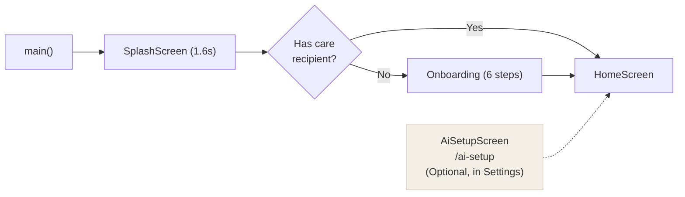
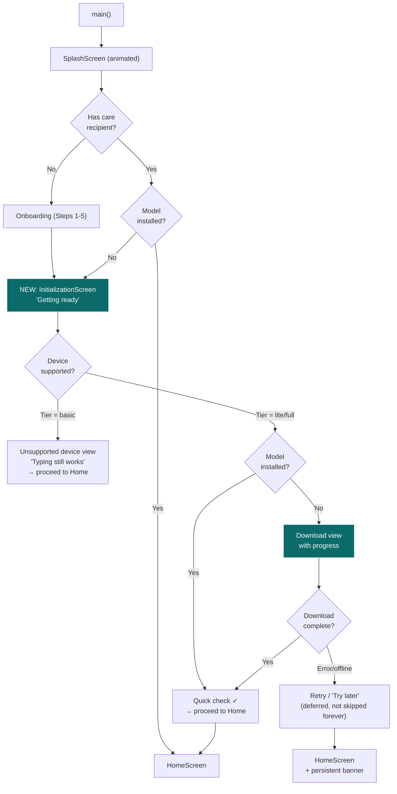

# Plan: Mandatory Phone Helper Initialization at Startup

## Summary

Make the AI model (Phone helper) initialization **mandatory** — the app checks for and downloads the model on startup, replacing the current optional "get it later" approach. A new **Initialization Screen** gates the app until the model is ready (or the device genuinely can't run it).

---

## Current State (What We Have)



**Problems identified:**
1. **Model download is buried** — it's a separate screen at `/ai-setup` that users reach from Settings or onboarding. Most users will never find it.
2. **No startup gate** — the app happily launches into HomeScreen with `NullEngine` (Basic mode), and voice/snap capture silently fall back to typed text. Users don't realize the "Phone helper" isn't working.
3. **`FlutterGemma.initialize()`** runs in `main()` but the model file is checked lazily by `resolvedEngineProvider` — there's no blocking initialization screen.
4. **The splash screen is purely decorative** (1.6s fixed timer) — it doesn't actually wait for anything meaningful.

---

## Proposed State (What We Want)



### Key Design Decisions

| Decision | Choice | Rationale |
|---|---|---|
| Is download skippable? | **Yes, but with friction** — "Try later" not "Skip". Banner persists on HomeScreen until model is installed. | Can't force a 2 GB download on cellular. But we make it clear this isn't a feature they want to skip. |
| When does the init screen show? | **Every cold start** until the model is installed (or device is unsupported) | Returning users with an installed model see a 1-2s "Checking…" then proceed. Only first-time or uninstalled users see the download flow. |
| What about unsupported devices? | Show a clear explanation, then let them through to Basic mode permanently | No point blocking a device that can't run the model |
| Does onboarding still have a Phone helper step? | **No, remove it** — the InitializationScreen replaces it | Avoids duplicate download UI. Onboarding stays focused on profile + contacts + meds. |
| What happens on subsequent launches? | If model installed → flash "Ready ✓" (< 1s) → HomeScreen. If model deleted → InitializationScreen again. | `resolvedEngineProvider` already watches `modelStatusProvider`, so this is reactive. |

---

## Issues Found During Research

> [!WARNING]
> ### Issue 1: `FlutterGemma.initialize()` is fire-and-forget
> In [`main.dart`](file:///Users/john/Develop/ailaga/lib/main.dart#L23-L27), `FlutterGemma.initialize()` is wrapped in a bare `try/catch` that swallows all errors. If it fails for a real reason (e.g. native library not loaded), there's no diagnostic info — the app silently falls to `NullEngine` and the user has no idea why voice capture doesn't work.
> 
> **Fix:** Log the error via `ErrorHandler.recordError()` and surface a diagnostic in the new InitializationScreen if the engine can't initialize.

> [!WARNING]
> ### Issue 2: Splash screen timer is not tied to actual initialization
> The [`SplashScreen`](file:///Users/john/Develop/ailaga/lib/features/onboarding/presentation/splash_screen.dart#L39-L41) uses a hardcoded 1600ms `Timer` then calls `context.go('/')`. It doesn't wait for the database, notification service, or AI engine to be ready. If `appDatabaseProvider` takes longer than 1.6s (first run, migration), the router redirect reads an unresolved `primaryCareRecipientProvider` and may misroute.
>
> **Fix:** Make the splash screen watch actual initialization completion, not a fixed timer. The animation still plays but navigation only fires when providers are ready.

> [!WARNING]
> ### Issue 3: `resolvedEngineProvider` triggers on every download progress tick
> In [`ai_providers.dart`](file:///Users/john/Develop/ailaga/lib/services/ai/local/ai_providers.dart#L49-L51), there's already a `selectAsync` to only watch the install *state* (not progress), but the comment indicates this was a discovered bug. The `modelStatusProvider` is a `StreamProvider` that yields every `ModelStatus` event. The `selectAsync` mitigates UI churn but the `FutureProvider` still re-evaluates. During a 2 GB download, this means `resolvedEngineProvider` rebuilds hundreds of times.
>
> **Fix (minor):** This is already handled well enough by the `selectAsync`. Just be aware that the new InitializationScreen should watch `modelStatusProvider` directly for progress, not through `resolvedEngineProvider`.

> [!CAUTION]
> ### Issue 4: No model download URL validation at startup
> The model URL comes from a `const` in [`ai_setup_providers.dart`](file:///Users/john/Develop/ailaga/lib/features/ai_setup/data/ai_setup_providers.dart#L37-L43) or `--dart-define`. If it's empty/malformed, `ModelManager.install()` emits `error: 'no_download_url'` but this only happens when the user manually taps "Get it" on the setup screen. In the new mandatory flow, this will be caught earlier and surfaced with a proper message.

> [!NOTE]
> ### Issue 5: iOS doesn't need a download — FoundationModels is OS-built-in
> [`resolvedEngineProvider`](file:///Users/john/Develop/ailaga/lib/services/ai/local/ai_providers.dart#L37-L42) already handles iOS by checking `AppleAiChannel.isAvailable()`. The InitializationScreen should detect iOS and show "Checking…" → "Ready" (if Apple Intelligence enabled) or "Turn on Apple Intelligence in Settings" (if not). No download needed.

> [!NOTE]
> ### Issue 6: Demo flavor needs special handling
> The `demo` flavor has no INTERNET permission. The InitializationScreen must detect this (via the flavor or connectivity) and either: (a) expect the model to be pre-loaded via `adb push`, or (b) skip the download flow entirely and proceed to Basic mode with a note.

---

## Implementation Plan

### Step 1: Create `InitializationScreen` widget
**File:** `lib/features/onboarding/presentation/initialization_screen.dart`  
**Owner:** B (it's a presentation screen in onboarding flow) with C's providers  

A full-screen, warm-background widget with these states:

| State | Visual | Action |
|---|---|---|
| **Checking** | App mark + "Getting ready…" + spinner | Resolves `deviceTierProvider` + `modelStatusProvider` |
| **Downloading** | "Downloading" + large % number + progress bar + file size + "Pause" button | Watches `modelStatusProvider` stream |
| **Verifying** | "Checking…" + progress bar at 100% | SHA-256 verification |
| **Ready** | ✓ icon + "Ready" | Auto-navigates to HomeScreen after 1s |
| **Unsupported** | Lock icon + "This phone is too small for the helper" + "Typing still works" | "Continue" button → HomeScreen |
| **Error** | ✗ icon + plain-language error + "Try again" / "Try later" | "Try later" → HomeScreen with banner |
| **iOS Ready** | ✓ icon + "Ready" | If Apple Intelligence available |
| **iOS Unavailable** | Settings instruction | "Continue" button |

**UI rules applied:**
- Background `#FFFDF8`, teal `#0B6B6B` accents
- Body 20sp (Helper mode), buttons 64dp, ≥48dp touch targets
- Icon + word (never icon alone)
- No jargon: "Phone helper" not "AI model", "Getting ready" not "Initializing"
- Progress shows real file size from server, never hardcoded

### Step 2: Add `/initialization` route
**File:** `lib/app/router.dart`  

```dart
GoRoute(
  path: '/initialization',
  builder: (_, __) => const InitializationScreen(),
),
```

Outside the `ShellRoute` (no bottom nav during initialization).

### Step 3: Update router redirect logic
**File:** `lib/app/router.dart`  

Current redirect only checks for care recipient. New logic:

```
if path == '/splash' or '/initialization' → allow through
if no care recipient → /onboarding
if care recipient exists AND model not installed AND device supported → /initialization
if care recipient exists AND model installed → /
```

Need a synchronous-safe way to check model status in the redirect. Options:
- **Option A:** Read `modelStatusProvider` — but it's a `StreamProvider` (async). The redirect is already async-capable via `ref.read()`.
- **Option B:** Add an `appReadyProvider` that combines `primaryCareRecipientProvider` + `modelStatusProvider` into a single `AsyncValue<AppReadyState>`.

**Recommendation:** Option B — cleaner, single source of truth.

### Step 4: Create `appReadyProvider`
**File:** `lib/app/app_ready_provider.dart` (new)

```dart
enum AppReadyState {
  needsOnboarding,      // no care recipient
  needsModelSetup,      // has recipient, model not installed, device supported
  unsupportedDevice,    // has recipient, device tier = basic
  ready,                // has recipient, model installed (or iOS AI available)
  unknown,              // still loading
}

final appReadyProvider = FutureProvider<AppReadyState>((ref) async {
  // Check care recipient
  // Check device tier
  // Check model install status
  // Return appropriate state
});
```

### Step 5: Make splash screen wait for real readiness
**File:** `lib/features/onboarding/presentation/splash_screen.dart`

Change from fixed 1600ms timer to:
1. Play the animation (700ms).
2. Watch `appReadyProvider`.
3. When resolved, navigate to the correct destination (`/onboarding`, `/initialization`, or `/`).
4. Minimum display time of 1.2s so the animation completes gracefully.

### Step 6: Update `main.dart` — log `FlutterGemma` init failures
**File:** `lib/main.dart`

```dart
try {
  await FlutterGemma.initialize(inferenceEngines: [LiteRtLmEngine()]);
} catch (e, stack) {
  ErrorHandler.recordError(e, stack);
  // Engine init failed — will be surfaced in InitializationScreen
}
```

### Step 7: Add persistent "Setup needed" banner to HomeScreen
**File:** `lib/features/home/presentation/home_screen.dart`

When model is not installed and device is supported, show a tappable banner:
> 🔒 Phone helper not ready · **Set up**

Tapping navigates to `/initialization`. Banner disappears when `modelStatusProvider` reports `installed`.

### Step 8: Wire onboarding completion → InitializationScreen
**File:** `lib/features/onboarding/presentation/onboarding_screen.dart`

After Step 5 (Ready → "Start Using AILaga"), instead of `context.go('/')`, navigate to `context.go('/initialization')`. The InitializationScreen handles the model check and either starts download or proceeds to home.

### Step 9: Update "Try a demo" flow
**File:** `lib/features/onboarding/presentation/onboarding_screen.dart`

After seeding demo data, route to `/initialization` instead of `/`. If the model is already installed or the device is unsupported, the InitializationScreen will flash through quickly.

### Step 10: Clean up existing AiSetupScreen
**File:** `lib/features/ai_setup/presentation/ai_setup_screen.dart`

Keep this screen as the Settings entry point for managing the model (delete, re-download, see size). But remove the "Skip" button — it's no longer the primary download path. Replace with "Done" / back navigation.

---

## Files Changed (Summary)

| File | Change | Owner |
|---|---|---|
| `lib/features/onboarding/presentation/initialization_screen.dart` | **NEW** — Main initialization/download screen | B + C |
| `lib/app/app_ready_provider.dart` | **NEW** — Combined readiness state provider | B |
| `lib/app/router.dart` | Add `/initialization` route + update redirect | Shared |
| `lib/features/onboarding/presentation/splash_screen.dart` | Wait for real readiness instead of fixed timer | B |
| `lib/main.dart` | Log FlutterGemma init errors properly | B |
| `lib/features/onboarding/presentation/onboarding_screen.dart` | Route to `/initialization` after completion | B |
| `lib/features/home/presentation/home_screen.dart` | Add persistent "setup needed" banner | B |
| `lib/features/ai_setup/presentation/ai_setup_screen.dart` | Remove "Skip", keep as settings management | C |

---

## Safety Checklist

- [x] SOS never touches this flow — Emergency route is independent, outside ShellRoute
- [x] Basic mode still works — unsupported devices bypass download entirely
- [x] "Try later" available — can't force a 2GB download (cellular, low battery, etc.)
- [x] No jargon — "Phone helper", "Getting ready", never "AI model" or "initializing"
- [x] Real file sizes — from HEAD request, never hardcoded
- [x] iOS handled — FoundationModels check, no download needed
- [x] Demo flavor handled — model expected pre-loaded or Basic mode
- [x] Deterministic fallback intact — `NullEngine` is always the safe default
- [x] No AI writes to repositories — this plan only changes the boot flow, not the AI→propose→validate→confirm pipeline

---

## Estimated Effort

| Step | Time | Notes |
|---|---|---|
| Steps 1-2: InitializationScreen + route | 2-3 hours | Most complex — the download UI with all states |
| Steps 3-4: Router + appReadyProvider | 1 hour | Logic is straightforward |
| Step 5: Splash screen fix | 30 min | |
| Steps 6-7: main.dart + HomeScreen banner | 30 min | |
| Steps 8-9: Onboarding wiring | 30 min | |
| Step 10: AiSetupScreen cleanup | 15 min | |
| Testing | 1-2 hours | Widget tests for each InitializationScreen state |
| **Total** | **~6-7 hours** | |
